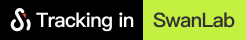

# SwanLab Assets

## Github Badge

Visualize in SwanLab { width=120% height=120% }

Tracking in SwanLab { width=120% height=120% }

## Logo

Logo1-light.svg

Logo1-dark.svg

Logo2-light.svg

Logo2-dark.svg

